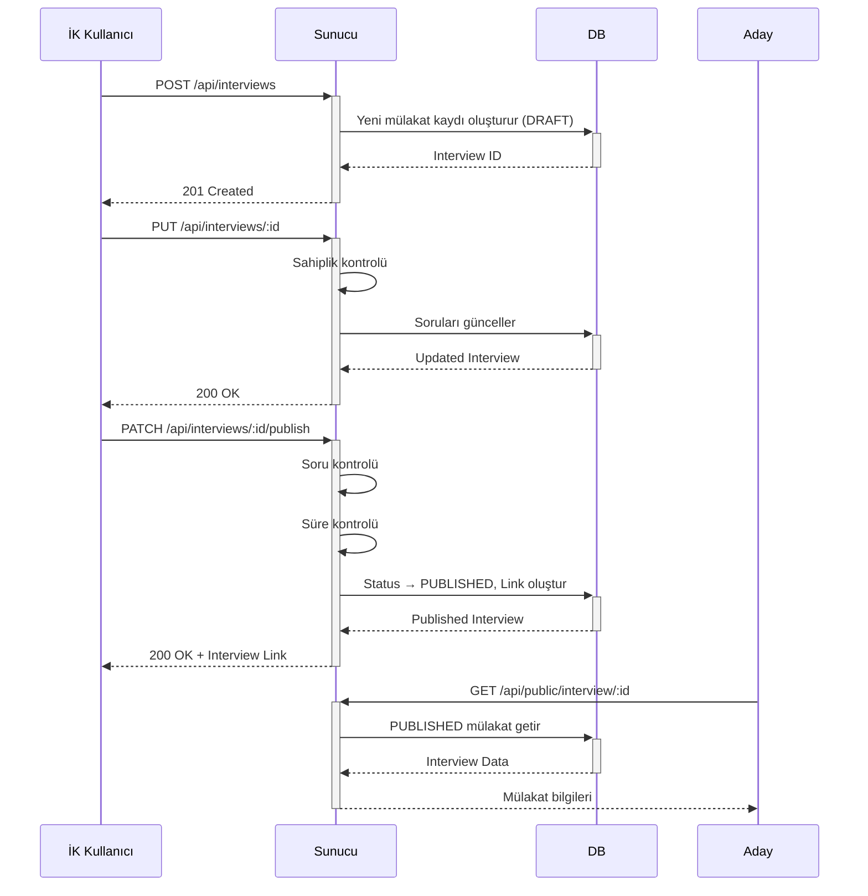

# Interview Modülü - Mülakat Yönetim Sistemi

Bu modül, İK ekiplerinin mülakat oluşturmasını, soruları yönetmesini ve adaylarla paylaşmasını sağlar.
Mülakatlar belirli durumlara (taslak, yayınlandı, inaktif) göre güncellenebilir.

## 🎯 Modülün Amaçları

- İK kullanıcıları yeni mülakat setleri oluşturabilir
- Sorular, kişilik testi, link ve son başvuru tarihi gibi bilgiler düzenlenebilir
- Adaylar yalnızca "yayınlanmış" mülakatlara katılabilir
- İK kullanıcıları kendi mülakatlarını yönetir (Create, Read, Update, Delete)
- **Soft Delete** stratejisi ile veri kaybı önlenir
- AI analiz ayarları ile gelişmiş değerlendirme desteği

## 📚 Ana Fonksiyonlar

| Fonksiyon                   | Açıklama                                                     |
| --------------------------- | ------------------------------------------------------------ |
| `createInterview()`         | Yeni bir mülakat oluşturur (DRAFT durumunda)                 |
| `getAllInterviews()`        | (Admin) Sistemdeki tüm mülakatları listeler                  |
| `getUserInterviews()`       | İlgili İK kullanıcısının kendi mülakatlarını listeler        |
| `getInterviewById(id)`      | Belirli bir mülakatın detaylarını getirir                    |
| `updateInterview(id)`       | Mülakatın detaylarını günceller                              |
| `deleteInterview(id)`       | Mülakatı soft delete yapar (deletedAt timestamp ekler)       |
| `publishInterview(id)`      | Mülakatın durumunu DRAFT → PUBLISHED yapar ve link oluşturur |
| `generateInterviewLink(id)` | Mülakat linkinin süresini günceller                          |

## 🛠️ Yapı ve Akış

### 1. InterviewController (`controllers/interview.controller.ts`)

- HTTP isteklerini alır
- Giriş doğrulaması yapar (`req.user`)
- İş kurallarını `InterviewService`'e yönlendirir
- Hataları `next(error)` ile Express hata yönetimine gönderir
- Sahiplik kontrolü (`checkOwnership()`) yapar

### 2. InterviewService (`services/interview.service.ts`)

- İş kurallarını uygular:
  - Sadece mülakatı oluşturan kullanıcı güncelleme/silme yapabilir
  - PUBLISHED mülakatların temel alanları (sorular, başlık) değiştirilemez
  - Mülakat yayınlanmadan önce soru kontrolü yapılır
  - Süresi dolmuş mülakat yayınlanamaz
- Repository katmanını çağırır
- `AppError` ile tutarlı hata yönetimi sağlar

### 3. InterviewRepository (`repositories/interview.repository.ts`)

- MongoDB işlemlerini yapar
- Soft delete desteği (her sorguda `deletedAt: null` kontrolü)
- Populate işlemleri (User, PersonalityTest)
- Interview link oluşturma

## 📂 API Endpoints

| Metot    | URL                           | Açıklama                               | Yetki                 |
| -------- | ----------------------------- | -------------------------------------- | --------------------- |
| `POST`   | `/api/interviews`             | Yeni mülakat oluştur                   | Authenticated         |
| `GET`    | `/api/interviews/all`         | Tüm mülakatları getir                  | Admin                 |
| `GET`    | `/api/interviews/my`          | Kullanıcının kendi mülakatlarını getir | Authenticated         |
| `GET`    | `/api/interviews/:id`         | Belirli bir mülakatı getir             | Authenticated (Owner) |
| `PUT`    | `/api/interviews/:id`         | Mülakat bilgilerini güncelle           | Authenticated (Owner) |
| `DELETE` | `/api/interviews/:id`         | Mülakatı soft delete yap               | Authenticated (Owner) |
| `PATCH`  | `/api/interviews/:id/publish` | Mülakatı yayınla (DRAFT → PUBLISHED)   | Authenticated (Owner) |
| `PATCH`  | `/api/interviews/:id/link`    | Mülakat linki süresini güncelle        | Authenticated (Owner) |

### ⚠️ Önemli: Route Sıralaması

Spesifik route'lar (`/all`, `/my`) parametreli route'lardan (`/:id`) **önce** tanımlanmalıdır.

## 📑 Veri Modeli

### Interview Model Fields

```typescript
{
  title: string;                    // Mülakat başlığı
  description?: string;             // Açıklama
  expirationDate: Date;             // Son başvuru tarihi
  createdBy: {
    userId: ObjectId;               // Oluşturan kullanıcı
  };
  status: InterviewStatus;          // 'draft' | 'published' | 'active' | 'completed' | 'inactive'

  // Pozisyon bilgileri (AI Server için)
  position?: {
    title: string;
    department?: string;
    competencyWeights?: {
      technical?: number;
      communication?: number;
      problem_solving?: number;
    };
    description?: string;
  };

  personalityTestId?: ObjectId;     // Kişilik testi referansı

  stages: {
    personalityTest: boolean;
    questionnaire: boolean;
  };

  interviewLink: {
    link: string;                   // Frontend link (ör: /application/:id)
    expirationDate?: Date;
  };

  questions: IInterviewQuestion[];  // Soru dizisi

  // AI Analiz Ayarları
  aiAnalysisSettings: {
    useAutomaticScoring: boolean;
    gestureAnalysis: boolean;
    speechAnalysis: boolean;
    eyeContactAnalysis: boolean;
    tonalAnalysis: boolean;
    keywordMatchScore: number;
  };

  deletedAt?: Date;                 // Soft delete timestamp
  createdAt: Date;
  updatedAt: Date;
}
```

### Question Model

```typescript
{
  questionText: string;
  expectedAnswer: string;
  explanation?: string;
  keywords: string[];
  order: number;
  duration: number;                 // Saniye cinsinden
  aiMetadata: {
    complexityLevel: 'low' | 'medium' | 'high' | 'intermediate' | 'advanced';
    requiredSkills: string[];
    keywordMatchScore?: number;
  };
}
```

## 📚 Kullanılan Teknolojiler

| Teknoloji      | Kullanım Alanı                                                    |
| -------------- | ----------------------------------------------------------------- |
| **Mongoose**   | MongoDB veritabanı işlemleri                                      |
| **Express.js** | API rotaları ve controller yapısı                                 |
| **TypeScript** | Tip güvenli backend geliştirme                                    |
| **Joi**        | DTO validation (`createInterviewSchema`, `updateInterviewSchema`) |
| **Jest**       | Unit ve integration testler                                       |

## 🔄 Statü Geçiş Kuralları

- ✅ `DRAFT` → `PUBLISHED` yapılabilir (sorular ve süre kontrolü yapılır)
- ✅ `PUBLISHED` → `INACTIVE` yapılabilir
- ❌ `PUBLISHED` durumunda temel alanlar (title, questions) değiştirilemez
- ❌ Süresi dolmuş mülakat yayınlanamaz
- ❌ Sorusuz mülakat yayınlanamaz

## 🔒 Güvenlik ve Yetkilendirme

### Middleware'ler

- `authenticate`: JWT token kontrolü
- `validateRequest`: Joi schema validation
- `asyncHandler`: Async error handling

### Yetki Kontrolleri

- **Owner Check**: Sadece mülakatı oluşturan kullanıcı güncelleyebilir/silebilir
- **Admin Access**: `/all` endpoint'i sadece admin kullanıcılar için
- **Privacy Control**: DRAFT mülakatlar sadece sahibi tarafından görülebilir

## 🧪 Test Coverage

### Unit Tests (`interview.service.test.ts`)

- ✅ Interview oluşturma validasyonları
- ✅ Soru zorunluluğu kontrolü
- ✅ Tarih format validasyonu
- ✅ PUBLISHED mülakat koruma kuralları
- ✅ Publish işlemi iş kuralları
- ✅ Soft delete operasyonları

### Unit Tests (`interview.controller.test.ts`)

- ✅ HTTP request handling
- ✅ Authentication kontrolü
- ✅ Sahiplik validasyonu
- ✅ Error response formatları
- ✅ Admin yetki kontrolleri

### Integration Tests (`interview.integration.test.ts`)

- ✅ End-to-end API testleri
- ✅ Database işlem doğrulamaları
- ✅ Cross-user authorization testleri
- ✅ Soft delete verification

**Test Komutları:**

```bash
# Tüm testleri çalıştır
npm test

# Sadece Interview modülü testleri
npm test -- interview

# Coverage raporu
npm test -- --coverage
```

## 🚀 İş Akışı Örneği



## 🧹 Kurallar ve Best Practices

1. **Sahiplik Prensibi**: Her kullanıcı sadece kendi oluşturduğu mülakatlar üzerinde işlem yapabilir
2. **Soft Delete**: Mülakatlar silindiğinde veri kaybı yaşanmaz (`deletedAt` timestamp)
3. **Immutable Published State**: Yayınlanmış mülakatların temel alanları korunur
4. **Validation-First**: Her input Joi schema ile validate edilir
5. **Error Consistency**: Tüm hatalar `AppError` class'ı ile fırlatılır
6. **Async Safety**: Tüm async fonksiyonlar `asyncHandler` ile wrap'lenir

## 🐛 Bilinen Sorunlar ve Geliştirme Notları

- ✅ **DÜZELTILDI**: Route sıralama sorunu (/:id en sona alındı)
- ✅ **DÜZELTILDI**: Error handling tutarlılığı (`return next` → `throw`)
- ✅ **DÜZELTILDI**: Soft delete stratejisi tutarlılığı
- ⚠️ **TODO**: Integration testler için test database setup
- ⚠️ **TODO**: Interview link encryption/encoding stratejisi

## 📞 İlgili Modüller

- **Application Module**: Aday başvurularını yönetir
- **Dashboard Module**: Mülakat istatistiklerini gösterir
- **AI Analysis Module**: Video analiz sonuçlarını işler
- **Personality Test Module**: Kişilik testi entegrasyonu

Katılım Linki: Her mülakata özel URL üretilir.

Kişilik Testi: Mülakata opsiyonel olarak eklenebilir.

📦 Önemli Bağımlılıklar
axios – Yok (şu anda sadece backend içi işlemler)

mongoose – Model işlemleri için.

joi – Body validasyon için.

dotenv – Ortam değişkenleri için.

✅ Özet
Interview Modülü, İK tarafı için profesyonel, esnek ve güvenli mülakat yönetimi sağlar.
Adaylara doğru sorularla ulaşılmasını ve mülakat sürecinin kontrollü bir şekilde ilerlemesini destekler.

İlerleyen geliştirmeler:

Mülakata özel zamanlayıcılar

Gerçek zamanlı mülakat analizi

Çoklu dil destekli soru havuzları

Admin raporlama panelleri
