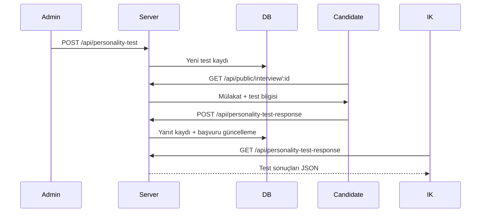

# Personality Test Modülü - Aday Kışilik Test Yönetimi

Bu modül, adayların mülakat süreçlerinde kışilik testlerine katılmasını sağlar. İK kullanıcıları yeni testler oluşturabilir, adaylar bu testlere cevap verir ve sonuçlar sistemde saklanır.

## 🌟 Modül Amaçları

- Admin kullanıcılar yeni kişilik testleri tanımlar.
- Adaylar, mülakat sürecinde testleri çözerek yanıtlarını gönderir.
- Test sonuçları adaya ve İK yetkililerine sunulur.

## 📚 Kapsanan Ana Fonksiyonlar

| Fonksiyon                       | Açıklama                          |
| ------------------------------- | --------------------------------- |
| createPersonalityTest()         | Yeni bir kişilik testi oluşturur. |
| getAllPersonalityTests()        | Tüm testleri listeler.            |
| getPersonalityTestById()        | Belirli bir testi getirir.        |
| updatePersonalityTest()         | Testi günceller.                  |
| deletePersonalityTest()         | Testi siler.                      |
| submitPersonalityTestResponse() | Adayın yanıtlarını kaydeder.      |
| getPersonalityTestResult()      | Test sonuçlarını getirir.         |

## 🛠️ Yapı ve Akış

- **PersonalityTestController**: Admin işlemleri yönetir.
- **PersonalityTestResponseController**: Aday test çözme ve sonuç görüntüleme.
- **PersonalityTestService**: Test CRUD işlemleri.
- **PersonalityTestResponseService**: Aday yanıt kaydı ve başvuru durumu güncellemesi.
- **Routes**:
  - Admin: `/api/personality-test`
  - Aday: `/api/personality-test-response`

## 📂 API Uç Noktaları

### Admin API'leri

| Metot  | URL                           | Açıklama            |
| ------ | ----------------------------- | ------------------- |
| POST   | /api/personality-test/        | Yeni test oluştur   |
| GET    | /api/personality-test/        | Tüm testleri getir  |
| GET    | /api/personality-test/:testId | Belirli testi getir |
| PUT    | /api/personality-test/:testId | Testi güncelle      |
| DELETE | /api/personality-test/:testId | Testi sil           |

> **Not**: Admin authentication zorunludur (authenticateAdmin).

### Aday API'leri

| Metot | URL                             | Açıklama            |
| ----- | ------------------------------- | ------------------- |
| POST  | /api/personality-test-response/ | Yanıtları gönder    |
| GET   | /api/personality-test-response/ | Sonuçları görüntüle |

> **Not**: Aday authentication zorunludur (authenticateCandidate).

## 📁 Kullanılan Yapılar

- **Mongoose**: PersonalityTestModel, PersonalityTestResponseModel.
- **Express.js**: API yönetimi.
- **Middleware**: authenticateAdmin, authenticateCandidate, asyncHandler.
- **DTO**: CreatePersonalityTestDTO, SubmitPersonalityTestResponseDTO vb.

## 🔥 İş Akışı Örneği

## 📋 Temel Kurallar

- Her aday her testi sadece bir kere çözebilir.
- Aday testi bitirdiğinde `application.personalityTestResults.completed = true` yapılır.
- Test CRUD işlemleri yalnızca Admin yetkisindedir.
- Aday tokenı olmadan test gönderimi yapılamaz.

## 📦 Önemli Bağımlılıklar

- **mongoose** - Veritabanı işlemleri.
- **dotenv** - Ortam değişkenleri.
- **Joi / DTO** - API veri validasyonu.

## ✅ Özet

Personality Test Modülü, adayın soft-skill analizini destekleyen, mülakatları daha nesnel hale getiren bir yapı sunar.

### Gelecek Geliştirmeler

- Test süre siniri eklenmesi.
- AI destekli kişilik analizi.
- Skora dayalı aday sıralaması.
- İstatistik ve grafik bazlı raporlama.
