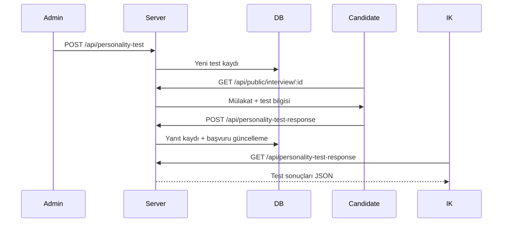

# 🧠 Personality Test Module

## 📋 Genel Bakış

Personality Test modülü, mülakat süreçlerine entegre edilebilen kişilik testlerinin yönetimini sağlar. Admin kullanıcılar test şablonları oluşturur, bu testler mülakatlarla ilişkilendirilir ve adaylar mülakat sırasında bu testleri çözer.

## 🎯 Modülün Amaçları

- Admin kullanıcıların kişilik testleri tanımlaması
- Farklı soru tipleri desteği (çoktan seçmeli, derecelendirme, açık uçlu)
- Big Five (OCEAN) kişilik modeli skorlaması
- Test sonuçlarının başvuruya kaydedilmesi
- AI analizine kişilik verileri sağlama

## 🏗️ Mimari Yapı

```
personalityTest/
├── controllers/
│   └── personalityTest.controller.ts    # Admin CRUD endpoint'leri
├── dtos/
│   └── personalityTest.dto.ts           # Validasyon şemaları
├── models/
│   └── personalityTest.model.ts         # MongoDB şeması
├── repositories/
│   └── personalityTest.repository.ts    # DB işlemleri
├── routes/
│   └── personalityTest.routes.ts        # Rota tanımları
├── services/
│   └── personalityTest.service.ts       # İş mantığı
└── README.md
```

## 🔗 Modül Bağımlılıkları

### İç Bağımlılıklar
| Modül | İlişki Türü | Açıklama |
|-------|-------------|----------|
| `interview` | Referans | Mülakatlara test atanır |
| `application` | Veri Kaynağı | Aday yanıtları application'a kaydedilir |
| `aiAnalysis` | Veri Sağlayıcı | Big Five skorları AI'a gönderilir |

### Tüketen Modüller
| Modül | Kullanım |
|-------|----------|
| `interview` | personalityTestId referansı |
| `application` | personalityTestResults depolama |

---

## 📊 Veri Modeli

### IPersonalityTest Interface

```typescript
interface IPersonalityTest {
  _id: ObjectId;
  testName: string;                        // Test adı (örn: 'Big Five', 'MBTI')
  description?: string;
  questions: ITestQuestion[];
  timestamps: { createdAt, updatedAt };
}
```

### ITestQuestion Interface

```typescript
interface ITestQuestion {
  _id?: ObjectId;
  questionText: string;
  questionType: QuestionType;
  choices?: string[];                      // Çoktan seçmeli için
  ratingScale?: number;                    // Derecelendirme için (default: 5)
  
  // Big Five Kişilik Özellikleri Etkisi
  personalityTraitsImpact?: {
    openness?: number;                     // Deneyime Açıklık
    conscientiousness?: number;            // Sorumluluk
    extraversion?: number;                 // Dışadönüklük
    agreeableness?: number;                // Uyumluluk
    neuroticism?: number;                  // Duygusal Dengesizlik
  };
}
```

### QuestionType Enum

```typescript
type QuestionType = 
  | 'multiple_choice'    // Çoktan seçmeli
  | 'rating'             // Derecelendirme (1-5, 1-10)
  | 'open_text';         // Açık uçlu
```

### Big Five (OCEAN) Model

| Özellik | Kod | Açıklama |
|---------|-----|----------|
| Openness | O | Deneyime Açıklık |
| Conscientiousness | C | Sorumluluk |
| Extraversion | E | Dışadönüklük |
| Agreeableness | A | Uyumluluk |
| Neuroticism | N | Duygusal Dengesizlik |

---

## 🔄 İş Akışları

### 1. Test Oluşturma Akışı (Admin)

```
┌─────────────────┐     ┌─────────────────┐     ┌─────────────────┐
│  Test Formu     │────▶│  Validasyon     │────▶│  Test Kaydet    │
│  (Admin Panel)  │     │  (Joi Schema)   │     │  (MongoDB)      │
└─────────────────┘     └─────────────────┘     └─────────────────┘
        │
        ▼
┌───────────────────────────────────────────────────────────┐
│  Her Soru İçin:                                           │
│  - questionText: Soru metni                               │
│  - questionType: multiple_choice | rating | open_text     │
│  - personalityTraitsImpact: Big Five ağırlıkları          │
└───────────────────────────────────────────────────────────┘
```

### 2. Aday Test Çözme Akışı

```
┌─────────────────┐     ┌─────────────────┐     ┌─────────────────┐
│  Mülakat        │────▶│  Test Soruları  │────▶│  Yanıt Gönder   │
│  Başlangıcı     │     │  Göster         │     │                 │
└─────────────────┘     └─────────────────┘     └─────────────────┘
                                                        │
                                                        ▼
                        ┌────────────────────────────────────────────┐
                        │  Skorlama:                                  │
                        │  - Her sorunun trait etkisi hesaplanır     │
                        │  - Big Five skorları toplanır              │
                        │  - personalityFit hesaplanır               │
                        │  - Application.personalityTestResults set   │
                        └────────────────────────────────────────────┘
```

### 3. AI Entegrasyonu

```
┌─────────────────┐     ┌─────────────────┐     ┌─────────────────┐
│  Test           │────▶│  Big Five       │────▶│  AI Server      │
│  Sonuçları      │     │  Skorları       │     │  Payload        │
└─────────────────┘     └─────────────────┘     └─────────────────┘
                                │
                                ▼
                    ┌──────────────────────┐
                    │  personalityTest: {  │
                    │    Big5: {           │
                    │      O: 75,          │
                    │      C: 82,          │
                    │      E: 68,          │
                    │      A: 71,          │
                    │      N: 45           │
                    │    }                 │
                    │  }                   │
                    └──────────────────────┘
```

---

## 📡 API Endpoints

### Admin Endpoints (Korumalı)

| Method | Endpoint | Açıklama | Auth |
|--------|----------|----------|------|
| `POST` | `/api/personality-test` | Yeni test oluştur | Admin |
| `GET` | `/api/personality-test` | Tüm testleri listele | Admin |
| `GET` | `/api/personality-test/:testId` | Test detayı | Admin |
| `PUT` | `/api/personality-test/:testId` | Test güncelle | Admin |
| `DELETE` | `/api/personality-test/:testId` | Test sil | Admin |

### Aday Endpoints

| Method | Endpoint | Açıklama | Auth |
|--------|----------|----------|------|
| `POST` | `/api/public/personality-test/response` | Test yanıtı gönder | Candidate |

> **Not**: Aday yanıt endpoint'i `application` modülündeki `candidate.controller` tarafından yönetilir.

---

## 🔧 Service Metodları

### PersonalityTestService

| Metod | Parametre | Dönüş | Açıklama |
|-------|-----------|-------|----------|
| `createPersonalityTest` | `CreatePersonalityTestDTO` | `IPersonalityTest` | Test oluştur |
| `getAllPersonalityTests` | - | `IPersonalityTest[]` | Tüm testler |
| `getPersonalityTestById` | `testId` | `IPersonalityTest` | Test detayı |
| `updatePersonalityTest` | `testId, UpdateDTO` | `IPersonalityTest` | Test güncelle |
| `deletePersonalityTest` | `testId` | `void` | Test sil |

---

## 📦 DTO Yapıları

### CreatePersonalityTestDTO

```typescript
interface CreatePersonalityTestDTO {
  testName: string;
  description?: string;
  questions: Array<{
    questionText: string;
    questionType: 'multiple_choice' | 'rating' | 'open_text';
    choices?: string[];
    ratingScale?: number;
    personalityTraitsImpact?: {
      openness?: number;
      conscientiousness?: number;
      extraversion?: number;
      agreeableness?: number;
      neuroticism?: number;
    };
  }>;
}
```

### PersonalityTestResults (Application'da)

```typescript
interface IPersonalityTestResults {
  testId: ObjectId;
  completed: boolean;
  scores?: {
    openness?: number;           // 0-100
    conscientiousness?: number;  // 0-100
    extraversion?: number;       // 0-100
    agreeableness?: number;      // 0-100
    neuroticism?: number;        // 0-100
  };
  personalityFit?: number;       // 0-100 (Pozisyon uyumu)
}
```

---

## 🛡️ Güvenlik

1. **Admin Koruması**
   - Test CRUD işlemleri `authenticateAdmin` middleware ile korunur
   - Sadece admin rolündeki kullanıcılar test yönetimi yapabilir

2. **Aday Erişimi**
   - Adaylar sadece kendilerine atanan testi çözebilir
   - Test bir kez tamamlandıktan sonra tekrar çözülemez (conflict: 409)

---

## 📈 Skorlama Mantığı

### Örnek Skor Hesaplama

```typescript
// Her soru için ağırlıklı katkı
const calculateScore = (answers: IAnswer[], questions: ITestQuestion[]) => {
  const scores = {
    openness: 0,
    conscientiousness: 0,
    extraversion: 0,
    agreeableness: 0,
    neuroticism: 0
  };
  
  answers.forEach((answer, index) => {
    const question = questions[index];
    const impact = question.personalityTraitsImpact;
    const answerValue = normalizeAnswer(answer, question);  // 0-1 arası
    
    Object.keys(impact).forEach(trait => {
      scores[trait] += impact[trait] * answerValue;
    });
  });
  
  // Normalize to 0-100
  return normalizeScores(scores);
};
```

---

## 🧪 Test Senaryoları

| Senaryo | Açıklama | Beklenen Sonuç |
|---------|----------|----------------|
| Test Oluşturma | Geçerli test verisi | 201 Created |
| Eksik Soru | questions: [] | 400 Bad Request |
| Yetkisiz Erişim | User rolü ile | 403 Forbidden |
| Tekrar Çözme | completed: true | 409 Conflict |
| Geçersiz Test ID | Olmayan test | 404 Not Found |

---

## 📝 Versiyon Notları

### v1.0 (Güncel)
- Big Five kişilik modeli desteği
- Çoktan seçmeli, derecelendirme ve açık uçlu soru tipleri
- AI Server entegrasyonu için skor formatı
- Admin CRUD işlemleri

---

## 🔗 İlgili Dokümantasyon

- [Interview Module](../interview/README.md)
- [Application Module](../application/README.md)
- [AI Analysis Module](../aiAnalysis/README.md)
| POST  | /api/personality-test-response/ | Yanıtları gönder    |
| GET   | /api/personality-test-response/ | Sonuçları görüntüle |

> **Not**: Aday authentication zorunludur (authenticateCandidate).

## 📁 Kullanılan Yapılar

- **Mongoose**: PersonalityTestModel, PersonalityTestResponseModel.
- **Express.js**: API yönetimi.
- **Middleware**: authenticateAdmin, authenticateCandidate, asyncHandler.
- **DTO**: CreatePersonalityTestDTO, SubmitPersonalityTestResponseDTO vb.

## 🔥 İş Akışı Örneği



## 📋 Temel Kurallar

- Her aday her testi sadece bir kere çözebilir.
- Aday testi bitirdiğinde `application.personalityTestResults.completed = true` yapılır.
- Test CRUD işlemleri yalnızca Admin yetkisindedir.
- Aday tokenı olmadan test gönderimi yapılamaz.

## 📦 Önemli Bağımlılıklar

- **mongoose** - Veritabanı işlemleri.
- **dotenv** - Ortam değişkenleri.
- **Joi / DTO** - API veri validasyonu.

## ✅ Özet

Personality Test Modülü, adayın soft-skill analizini destekleyen, mülakatları daha nesnel hale getiren bir yapı sunar.

### Gelecek Geliştirmeler

- Test süre siniri eklenmesi.
- AI destekli kişilik analizi.
- Skora dayalı aday sıralaması.
- İstatistik ve grafik bazlı raporlama.
